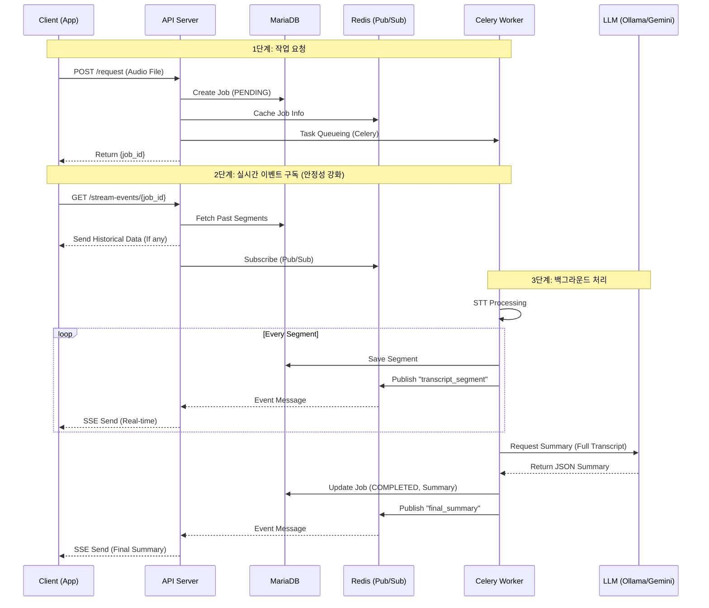
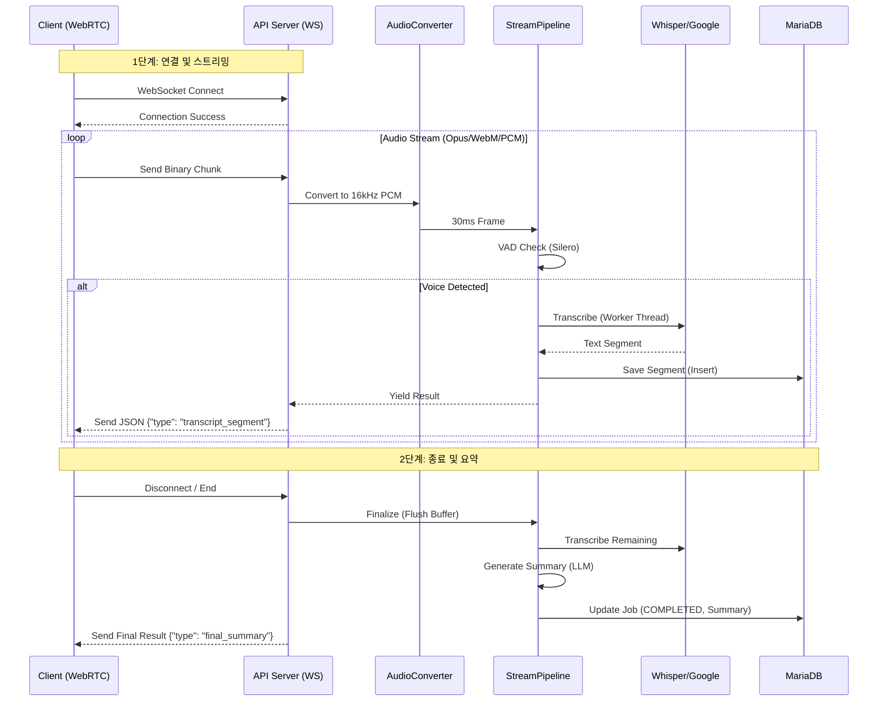

# STT/Summary API

실시간 STT(Speech-to-Text) 및 요약 API 서버입니다.

이 프로젝트는 `FastAPI`, `Celery`, `Redis`, `faster-whisper`를 Docker Compose로 실행하고, `Ollama` 또는 `LM Studio`(LLM 서버)는 로컬 호스트(Host) PC에서 실행합니다.

---

## 🚀 실행 방법

### 1. 사전 준비 (총 3가지)

1.  **Docker Desktop**을 설치하고 실행해야 합니다.
2.  **LLM 서버 준비 (택 1)**
    * 이 프로젝트는 로컬 LLM을 사용하여 요약을 수행합니다. **Ollama** 또는 **LM Studio** 중 하나를 선택하여 설치하세요.

    #### [옵션 A] Ollama 사용 시
    1.  **Ollama**를 설치합니다.
    2.  사용할 모델(`gemma3` 등)을 다운로드합니다.
        ```bash
        ollama pull gemma3
        ```

    #### [옵션 B] LM Studio 사용 시
    1.  **LM Studio**를 설치하고 실행합니다.
    2.  원하는 모델(예: `gemma-2-9b-it`, `llama-3-8b-instruct`)을 검색하여 다운로드합니다.
    3.  **Local Server** 탭(좌측 `<->` 아이콘)으로 이동합니다.
    4.  상단 중앙의 모델 선택 창에서 다운로드한 모델을 로드(Load)합니다.
    5.  우측 설정 패널에서 **Server Port**가 `1234`인지 확인합니다.
    6.  **"Start Server"** 버튼을 눌러 서버를 시작합니다.
3. 실행 설정 (.env)

프로젝트 루트의 `.env` 파일을 수정하여 사용할 LLM을 결정합니다. (파일이 없다면 생성하세요)

```ini
# --- LLM 선택 (ollama 또는 lmstudio) ---
LLM_PROVIDER=lmstudio

# --- LM Studio 설정 (기본값) ---
# Docker 컨테이너에서 호스트의 LM Studio로 접속하기 위한 주소
LMSTUDIO_BASE_URL=[http://host.docker.internal:1234/v1](http://host.docker.internal:1234/v1)

# --- Ollama 설정 ---
OLLAMA_BASE_URL=[http://host.docker.internal:11434](http://host.docker.internal:11434)
OLLAMA_MODEL_NAME=gemma3
```
### 2. 프로젝트 클론

### 3. 실행

1.  **[터미널 1]** 로컬 PC(Windows)에서 `Ollama` 서버를 **0.0.0.0 호스트**로 실행 (`$env:OLLAMA_HOST="0.0.0.0"`, `ollama serve`)하고 방화벽을 허용합니다.
2.  **[터미널 2]** `docker-compose up -d --build`를 실행합니다.

----------------------------

## 📂 프로젝트 구조

```bash
.
├── docker-compose.yml             # GPU 모드 실행 설정
├── docker-compose.cpu.yml         # CPU 모드 실행 설정
├── run-gpu.sh / run-cpu.sh        # 간편 실행 스크립트
├── requirements.txt               # 의존성 패키지 목록
│
└── stt_api/                       # 🐍 메인 애플리케이션 패키지
    ├── __init__.py
    ├── main.py                    # FastAPI 진입점 (Lifespan, 미들웨어, 라우터 설정)
    │
    ├── api/                       # 🌐 API 엔드포인트
    │   ├── __init__.py
    │   ├── batch_endpoints.py     # 파일 업로드 배치 처리 (POST /request, SSE)
    │   ├── stream_endpoints.py    # 실시간 WebSocket 스트리밍 (Google / Faster-Whisper)
    │   └── stream_endpoints_whisperlive.py # WhisperLiveKit 전용 스트리밍 엔드포인트
    │
    ├── core/                      # ⚙️ 핵심 설정 및 인프라
    │   ├── __init__.py
    │   ├── config.py              # 환경 변수 및 상수 관리 (Settings)
    │   ├── celery_config.py       # Celery 비동기 큐 설정 (Redis)
    │   ├── database.py            # DB 엔진 및 세션 관리 (SQLAlchemy Async)
    │   ├── logging_config.py      # 구조화된 로깅 (JSON/Color Formatter)
    │   └── exceptions.py          # 커스텀 예외 클래스 정의
    │
    ├── domain/                    # 📦 도메인 모델
    │   ├── __init__.py
    │   └── streaming_job.py       # 스트리밍 작업 상태 및 버퍼 관리 객체
    │
    ├── models/                    # 🗄️ 데이터베이스 스키마 (ORM)
    │   ├── __init__.py
    │   └── database_models.py     # MariaDB 테이블 매핑 (STTJob, STTSegment, STTRoom)
    │
    └── services/                  # 🛠️ 비즈니스 로직 서비스
        ├── __init__.py
        ├── tasks.py               # Celery 백그라운드 작업 (배치/방 요약)
        ├── audio_converter.py     # 오디오 리샘플링 및 포맷 변환 유틸리티
        │
        ├── stt/                   # 🎤 STT 엔진 모듈
        │   ├── __init__.py
        │   ├── stt_factory.py     # STT 엔진 선택 팩토리 (Google vs Local)
        │   ├── whisper_service.py # Faster-Whisper 구현체 (VAD 포함)
        │   ├── whisperlive_service.py # WhisperLiveKit 구현체 (실시간성 강화)
        │   ├── google_stt_service.py  # Google Cloud STT 구현체
        │   └── vad_processor.py   # 음성 활동 감지 (Silero VAD)
        │
        ├── llm/                   # 🧠 LLM 요약 서비스
        │   ├── __init__.py
        │   ├── base_llm_service.py # LLM 인터페이스 (추상 클래스)
        │   ├── gemini_service.py   # Google Gemini 구현체
        │   ├── ollama_service.py   # Ollama (Local) 구현체
        │   └── lm_service.py       # LM Studio 구현체
        │
        ├── storage/               # 💾 데이터 저장 및 관리
        │   ├── __init__.py
        │   ├── job_manager.py     # 작업 생명주기 통합 관리 (DB + Redis 파사드)
        │   ├── database_service.py # DB CRUD 로직
        │   └── cache_service.py   # Redis 캐시 및 Pub/Sub 메시징
        │
        └── pipeline/              # 🔄 처리 파이프라인
            ├── __init__.py
            ├── batch_pipeline.py  # 배치 처리 워크플로우 (파일 -> STT -> 요약)
            └── stream_pipeline.py # 스트리밍 워크플로우 (청크 -> VAD -> STT -> 큐)
```


---------------------

## 💾 파일 후처리 (SSE) 아키텍처 흐름

`POST /api/v1/conversation/request` (파일 업로드)와 `GET /api/v1/conversation/stream-events/{job_id}` (SSE 스트림) 요청 시의 상세 흐름입니다.




---------------------


## 🚀 실시간 스트리밍 (WebSocket) 아키텍처 흐름

`test_real_audio_stream.py` 실행 시, 클라이언트-서버-서비스 간의 상세한 상호작용 흐름입니다.

