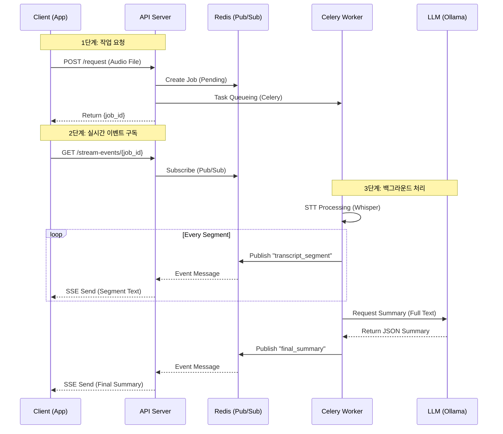
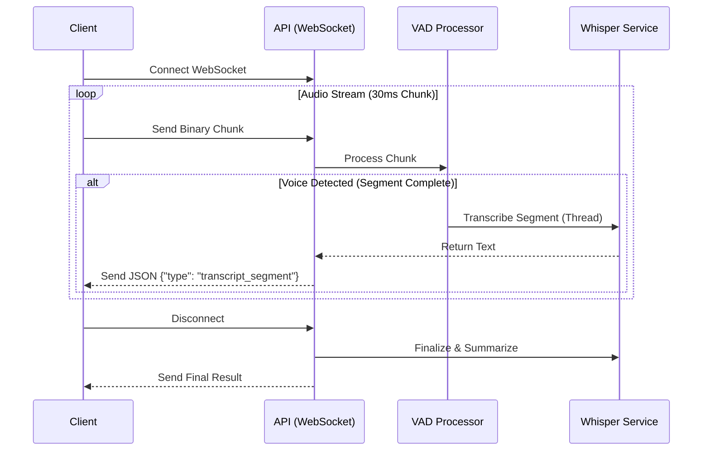

# STT/Summary API

실시간 STT(Speech-to-Text) 및 요약 API 서버입니다.

이 프로젝트는 `FastAPI`, `Celery`, `Redis`, `faster-whisper`를 Docker Compose로 실행하고, `Ollama`는 로컬 호스트(Host) PC에서 실행합니다.

---

## 🚀 실행 방법

### 1. 사전 준비 (총 3가지)

1.  **Docker Desktop**을 설치하고 실행해야 합니다.
2.  **Ollama**를 **호스트 PC(Windows/Mac)에 직접 설치**해야 합니다.
3.  Ollama에서 사용할 모델(`gemma3`)을 미리 받아야 합니다.
    ```bash
    ollama pull gemma3
    ```

### 2. 프로젝트 클론

### 3. 실행

1.  **[터미널 1]** 로컬 PC(Windows)에서 `Ollama` 서버를 **0.0.0.0 호스트**로 실행 (`$env:OLLAMA_HOST="0.0.0.0"`, `ollama serve`)하고 방화벽을 허용합니다.
2.  **[터미널 2]** `docker-compose up -d --build`를 실행합니다.

----------------------------

## 📂 프로젝트 구조

<details>

```bash
stt_api/
├── __init__.py                    # 패키지 초기화
├── main.py                        # FastAPI 애플리케이션 진입점 (서버 실행, 라우터 등록)
│
├── core/                          # 🔧 핵심 설정 및 인프라
│   ├── __init__.py
│   ├── config.py                  # 환경 설정 관리 (Settings, Constants, active_jobs)
│   ├── celery_config.py           # Celery 작업 큐 설정 (브로커, 워커)
│   ├── logging_config.py          # 구조화된 로깅 시스템 (JSON/컬러 포맷, StructuredLogger)
│   └── exceptions.py              # 커스텀 예외 정의 (CustomException, 도메인별 예외)
│
├── domain/                        # 📦 도메인 모델 (비즈니스 엔티티)
│   ├── __init__.py
│   └── streaming_job.py           # 실시간 스트림 작업 모델 (VAD, 대화록 관리)
│
├── services/                      # 🛠️ 비즈니스 로직 서비스
│   ├── __init__.py
│   │
│   ├── stt/                       # 🎤 음성-텍스트 변환 (STT)
│   │   ├── __init__.py            # 서비스 진입점 (함수 노출)
│   │   ├── whisper_service.py     # Whisper 모델 STT (배치/스트리밍 변환)
│   │   └── vad_processor.py       # 음성 활동 감지 (VAD, 실시간 세그먼트 분리)
│   │
│   ├── llm/                       # 🤖 LLM 요약 서비스
│   │   ├── __init__.py            # 프로바이더 자동 선택 (Ollama/LM Studio)
│   │   ├── base_llm_service.py    # LLM 서비스 추상 클래스 (인터페이스 정의)
│   │   ├── ollama_service.py      # Ollama LLM 구현체 (로컬 LLM)
│   │   └── lm_service.py          # LM Studio 구현체 (OpenAI 호환 API)
│   │
│   ├── storage/                   # 💾 데이터 저장 및 작업 관리
│   │   ├── __init__.py            # 서비스 통합 진입점
│   │   ├── job_manager.py         # 작업 생명주기 통합 관리 (DB + Redis 조율)
│   │   ├── database_service.py    # DB 추상화 레이어 (PostgreSQL/MySQL 대비)
│   │   └── cache_service.py       # Redis 캐시 서비스 (빠른 조회, Pub/Sub)
│   │
│   ├── pipeline/                  # 🔄 워크플로우 파이프라인
│   │   ├── __init__.py
│   │   ├── batch_pipeline.py      # 배치 처리 파이프라인 (파일 업로드 → STT → 요약)
│   │   └── stream_pipeline.py     # 실시간 스트리밍 파이프라인 (WebSocket → VAD → STT → 요약)
│   │
│   └── tasks.py                   # ⚙️ Celery 백그라운드 작업 (비동기 파이프라인 실행)
│
└── api/                           # 🌐 FastAPI 엔드포인트
    ├── __init__.py
    ├── batch_endpoints.py         # 배치 작업 API (POST /request, GET /result, SSE /stream-events)
    └── stream_endpoints.py        # 실시간 스트림 API (POST /create, WebSocket /ws)
```
</details>

---------------------

## 💾 파일 후처리 (SSE) 아키텍처 흐름

`POST /api/v1/conversation/request` (파일 업로드)와 `GET /api/v1/conversation/stream-events/{job_id}` (SSE 스트림) 요청 시의 상세 흐름입니다.




---------------------


## 🚀 실시간 스트리밍 (WebSocket) 아키텍처 흐름

`test_real_audio_stream.py` 실행 시, 클라이언트-서버-서비스 간의 상세한 상호작용 흐름입니다.

